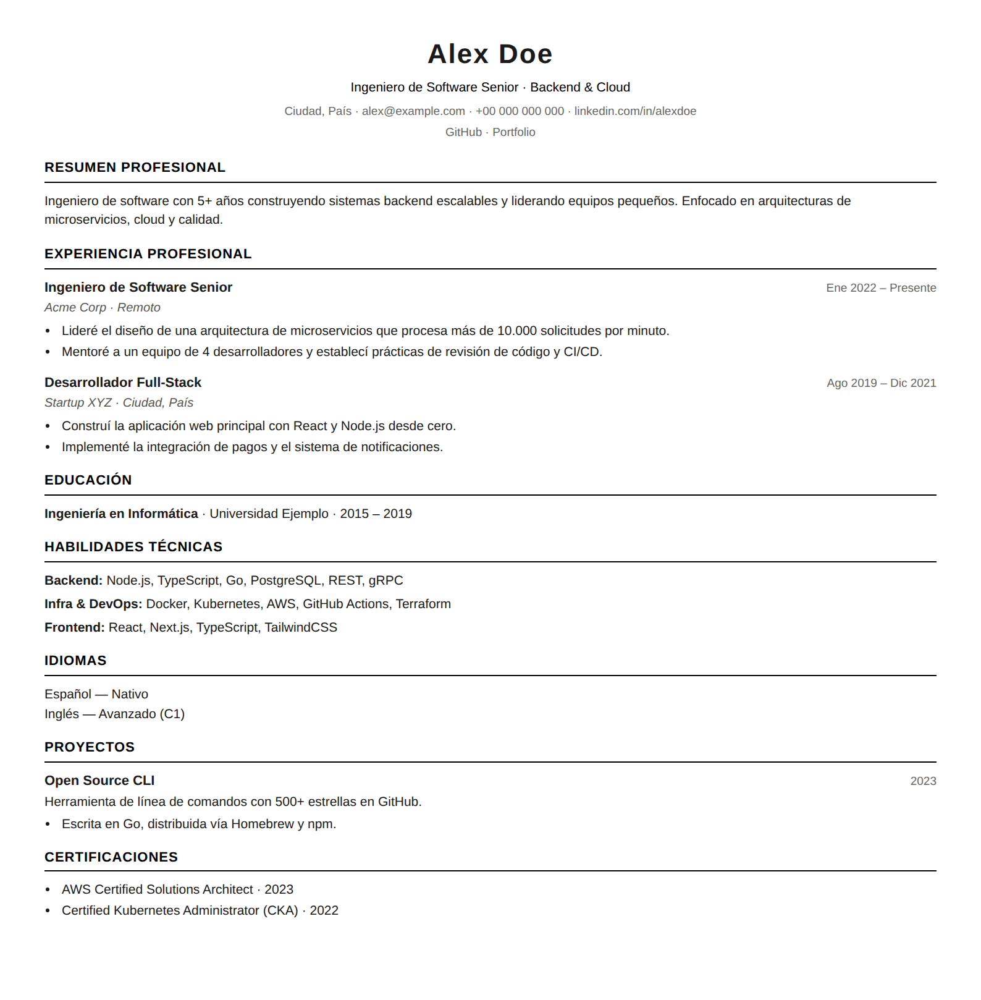

# cv-tailor


🌐 [English](README.md) · **Español**

**Convierte a tu agente de IA en tu asistente de postulaciones.** Conectado por MCP, tu
agente adapta tu CV a cada oferta, lo critica y mejora, genera el PDF/Word listo para
enviar y lleva el seguimiento de cada postulación hasta la entrevista. **Todo corre en tu
máquina: tus datos no se suben a ningún servidor.** Sin API keys ni servicios de pago —
funciona con el agente que ya usas (Claude, Cursor, VS Code… cualquier cliente MCP).

<br clear="right">



## ¿Qué problema resuelve?

Postular bien exige una versión del CV distinta por oferta, en el idioma correcto, en el
formato que pida el proceso — y saber después qué versión le enviaste a quién. Hacer eso
a mano con Word significa duplicar archivos y perder el control; hacerlo con un servicio
web significa entregarle tu historial laboral a un tercero.

Aquí en cambio:

- **Tu agente hace el trabajo**: le pides en lenguaje natural *"adapta mi CV a esta
  oferta"*, *"critícalo"*, *"registra que postulé"*, *"prepárame la entrevista"* — y él
  usa las herramientas del servidor MCP para hacerlo de verdad, con validación y
  métricas, no solo con opinión.
- **Todo es local y tuyo**: tus datos viven en archivos en tu carpeta (JSON legible,
  editable a mano); el servidor MCP corre en tu máquina y no llama a ninguna API externa.
- **Sin duplicar nada**: escribes tus datos una vez y cada postulación es una variante
  chica con solo lo que cambia (headline, orden de skills, carta).
- **Un comando genera todo**: PDF, Word, HTML y Markdown, en español, inglés o el idioma
  que agregues — con o sin IA, también funciona como CLI a secas.

## Empezar

Necesitas [Node.js](https://nodejs.org) ≥ 18 (sirve npm, pnpm, yarn o [Bun](https://bun.sh)).
Tienes tres formas de usarlo, de la más simple a la más manual.

### 1. Instálalo como servidor MCP — la forma recomendada (sin descargar el repo)

`cv-tailor` se publica en npm, así que tu cliente MCP lo lanza con `npx` sin que clones ni
instales nada a mano. Agrega este bloque en la config de tu cliente (Claude Desktop/Code,
Cursor, VS Code, Windsurf… cualquiera):

```json
{ "mcpServers": { "cv-tailor": {
  "command": "npx", "args": ["-y", "-p", "cv-tailor", "cv-tailor-mcp"],
  "env": { "CV_DIR": "/ruta/a/tu-carpeta-de-cv" }
} } }
```

`npx -y -p cv-tailor cv-tailor-mcp` descarga el servidor la primera vez y lo cachea. El
`-p cv-tailor` le indica a npx en qué paquete vive el comando `cv-tailor-mcp`; sin eso npx
busca un paquete llamado literalmente `cv-tailor-mcp` y falla con un 404. Define **`CV_DIR`**
apuntando a tu carpeta de datos (bajo `npx` el directorio de trabajo es impredecible, así
que conviene ser explícito). ¿No tienes datos aún? Copia la carpeta `examples/` del paquete
como punto de partida.

> El formato PDF usa el Chrome/Edge/Chromium que ya tienes instalado (no se descarga
> nada); los demás formatos no necesitan navegador.

La inteligencia la pone **el agente que ya usas** — el servidor no llama a ningún LLM ni
necesita API key, y todo corre en tu máquina. Luego trabajas en lenguaje natural; tu agente
usa las herramientas del servidor de verdad (con validación y métricas), no solo con opinión:

| Le dices a tu agente… | Qué pasa |
|---|---|
| *"Adapta mi CV a esta oferta"* (+ pegas la oferta) | Mide el match, elige tus logros relevantes, reescribe la variante **sin inventar experiencia** y verifica que el score mejoró |
| *"¿Qué tan bien calzo con esta oferta?"* | Score 0–100 con las keywords que cubres y las que faltan |
| *"Critica mi CV"* | Revisión medible + crítica de impacto con reescrituras propuestas |
| *"Entrevístame para llenar mi banco de logros"* | Preguntas + guarda cada logro confirmado, con métrica |
| *"Ya postulé a Acme, regístralo"* | Registra la postulación y **congela el PDF exacto que enviaste** |
| *"¿Qué postulaciones tengo estancadas?"* | Revisa el registro y redacta los follow-ups |
| *"Prepárame para la entrevista de Acme"* | Preguntas probables (incl. las incómodas sobre tus gaps) con qué logro responder |
| *"Traduce mi CV al francés"* | Detecta lo que falta y lo completa, validado |

Ciclo completo: **oferta → CV adaptado → postulación registrada → seguimiento → entrevista**.

### 2. …o descarga el código

Útil si quieres modificar la herramienta, contribuir o correrla sin depender de npm:

```bash
git clone https://github.com/Overrid3CL/cv-tailor.git && cd cv-tailor
npm install        # o: pnpm install · yarn · bun install
```

Para conectar tu agente al clon local, apunta la config MCP al archivo en vez de a `npx`:

```json
{ "mcpServers": { "cv-tailor": {
  "command": "node", "args": ["/ruta/a/cv-tailor/mcp-server.js"],
  "env": { "CV_DIR": "/ruta/a/tu-carpeta-de-cv" }
} } }
```

(Claude Code lee el `.mcp.json` del repo automáticamente al abrirlo.)

### 3. …o úsalo por línea de comandos (sin IA)

Instalado global (`npm install -g cv-tailor`) tienes el comando `cv-tailor`; desde el clon,
usa `node generate.js`:

```bash
# Instalado global: trabaja en tu carpeta de datos
cd ~/mi-cv && cv-tailor --variant tailored

# Desde el clon: pruébalo ya con el CV de ejemplo (ficticio)
CV_DIR=examples node generate.js --variant tailored

# Hazlo tuyo: copia el ejemplo a tu carpeta privada y edítalo
cp -r examples ~/mi-cv && CV_DIR=~/mi-cv node generate.js --variant tailored
```

El CV queda en `<carpeta>/output/tailored/` (PDF + Markdown). Sin IA también corren
`match.js` (analizar una oferta) y `lint.js` (calidad del CV) — ver [Uso diario](#uso-diario-cli).

> Tus datos viven en **tu carpeta** (`CV_DIR`), nunca en el repo — por eso `base.json`,
> `variants/`, `achievements.json` y `applications.json` de la raíz están en `.gitignore`.
> `examples/` es una carpeta de datos lista para copiar.

## Cómo funciona

```
base.json          ←  tu CV completo (datos, una sola vez)
variants/          ←  un archivo por postulación, con SOLO lo que cambia
achievements.json  ←  (opcional) banco de logros: materia prima para la IA
applications.json  ←  (opcional) registro de postulaciones + snapshots
        │
        ▼
node generate.js --variant <nombre> [--lang es|en|all] [--format pdf,docx,html,md]
        │
        ▼
output/<variante>/cv-... .pdf .docx .html .md   (+ carta de presentación)
```

Tres ideas clave:

1. **Datos ≠ código.** Todo lo tuyo está en JSON; la lógica de render no tiene contenido
   personal. Los textos bilingües se escriben `{ "es": "...", "en": "..." }` y agregar un
   idioma no requiere tocar código.
2. **Las variantes heredan de `base.json`** y sobreescriben lo mínimo: qué experiencia
   mostrar y en qué orden, headline, skills, carta. Nada se duplica.
3. **Todo lo que se escribe se valida** (JSON Schema + chequeos de referencias): un JSON
   inválido nunca llega a disco, lo edites tú o lo edite la IA.

## Uso diario (CLI)

Todos los comandos corren con `node` (o `bun`, si es lo tuyo — es indistinto):

```bash
node generate.js --list                                  # ver variantes
node generate.js --variant tailored --lang all           # todos los idiomas
node generate.js --variant tailored --doc all            # CV + carta
node generate.js --variant tailored --format docx        # Word
node generate.js --variant all --lang all                # todo de una vez
node generate.js --variant tailored --template modern    # otro diseño

node match.js --job oferta.txt --variant all   # ¿qué variante calza mejor con esta oferta?
cat ofertas.jsonl | node match.js --jobs-stdin # score masivo: N ofertas → [{id, lang, score}] ordenado
node lint.js --variant tailored                # revisión de calidad del CV (métricas, largos…)
node import.js mi-resume.json                  # importar desde JSON Resume
npm run validate                               # validar todos los datos
```

`match.js` y `lint.js` son 100% deterministas (sin IA): puntúan la cobertura de keywords
de una oferta y revisan buenas prácticas medibles.

**Score masivo** (`--jobs-stdin`): para filtrar decenas o cientos de ofertas de una vez —
por ejemplo exportadas desde una base de datos — se le pasa JSONL por stdin (una oferta
por línea: `{"id": "job-1", "text": "..."}`) y devuelve solo `[{id, lang, score}]`
ordenado por score, con el idioma autodetectado por oferta:

```bash
sqlite3 jobs.db "SELECT json_object('id', id, 'text', descripcion) FROM empleos" \
  | CV_DIR=~/mi-cv node match.js --jobs-stdin > scores.json
```

---

## Referencia

<details>
<summary><b>📄 Formatos y PDF</b></summary>

| Formato | Necesita Chromium | Uso |
|---|---|---|
| `pdf` | Sí | Entrega final (con saltos de página limpios y pie "página N de M" si hay 2+ páginas) |
| `docx` | No | Procesos que piden Word |
| `html` | No | Preview rápido / publicar |
| `md` | No | Texto plano / control de versiones |

`--format` acepta lista (`pdf,docx`) o `all`. El PDF encuentra solo el Chrome, Edge o
Chromium de tu sistema (no se descarga nada); si el tuyo está en una ruta no estándar,
define `PUPPETEER_EXECUTABLE_PATH` con su ejecutable (`PUPPETEER_LAUNCH_ARGS="--no-sandbox"`
en Docker/CI). Temas visuales: `--template classic|modern` (CSS en `templates/`; agregar un
tema = un archivo nuevo).

</details>

<details>
<summary><b>🗂 Estructura de <code>base.json</code></b></summary>

| Campo | Descripción |
|---|---|
| `name` / `contact` | Nombre y línea de contacto |
| `labels` | Títulos de sección por idioma (las claves de `labels` definen los idiomas soportados; **la primera es el idioma pivote**, el de autoría) + `closing` opcional para la carta |
| `dateTokens` | Traducción de tokens de fecha por idioma destino: `{ "en": { "Ene": "Jan", "Presente": "Present" } }` (las fechas se escriben en el idioma pivote) |
| `links` | Links del encabezado: `[{ "label": "GitHub", "url": "…" }]` |
| `experience[]` | `{ id, title, company, dates, bullets[] }` — cada texto `{es,en,…}` o string plano |
| `education[]` / `languages[]` / `skills` | Educación, idiomas y skills (`{ clave: { label, value } }`) |
| `custom_sections[]` | Secciones extra (proyectos, certificaciones…) con tres layouts: `entries` (como experiencia), `list` (viñetas) e `inline` (`label: value`) |
| `stopwords` / `weak_starters` | Opcionales: amplían las listas embebidas (es/en) del match y del lint para otros idiomas o dominios |

Un string traducible es un objeto por idioma (`{ "es": "…", "en": "…" }`, o `{ "en": "…" }`
si tu CV es solo en inglés — **ningún idioma es obligatorio**); un string plano se usa
igual en todos los idiomas. Para agregar un idioma: suma su clave a `labels` (y
`dateTokens` si aplica) y agrégala en los textos — la CLI, el MCP y las fechas (`Intl`) lo
reconocen solos. El prompt `translate_cv` puede completar las traducciones por ti.

</details>

<details>
<summary><b>🧩 Variantes y cartas de presentación</b></summary>

Crea `variants/<nombre>.json` con solo lo que cambia respecto de `base.json`:

| Campo | Efecto |
|---|---|
| `headline` / `summary` | Posicionamiento para ese rol |
| `experience_ids` | Qué entradas mostrar y en qué orden |
| `experience.<id>` | Sobreescribe campos de una entrada (o define una nueva) |
| `skills_order` / `skills.<clave>` | Orden/filtro y overrides de skills |
| `custom_sections.<id>` / `custom_sections_order` | Overrides y orden de secciones extra |
| `links` / `education` / `languages` | Reemplazan el array completo |
| `cover_letter` | Carta de presentación (abajo) |

La carta solo exige `body` (párrafos); `recipient`, `company`, `subject` y `closing` son
opcionales, y la fecha sale sola (localizada) si no la das:

```json
{
  "cover_letter": {
    "recipient": { "es": "Equipo de Selección", "en": "Hiring Team" },
    "company": "Example Inc.",
    "body": [ { "es": "Primer párrafo…", "en": "First paragraph…" } ]
  }
}
```

Se genera con `--doc cover` o `--doc all`. Ejemplo completo en `examples/variants/tailored.json`.

</details>

<details>
<summary><b>🏆 Banco de logros y 📌 tracker de postulaciones</b></summary>

**`achievements.json`** (opcional): logros granulares con tags, skills, métrica y la
experiencia de origen — más material del que cabe en un CV. La IA los usa como materia
prima al adaptar variantes (`suggest_achievements` los rankea contra cada oferta) y el
prompt `mine_achievements` lo llena entrevistándote. Ejemplo en
`examples/achievements.json`.

**`applications.json`** (opcional): registro de postulaciones — empresa, rol, fecha,
variante enviada, score del match y estado (`sent` → `interview`/`offer`/`rejected`/
`ghosted`). Al registrar con `log_application` se congela un snapshot en
`applications/<id>/`: el **PDF exacto que enviaste**, la variante de ese momento y la
oferta. Aunque edites tu CV después, siempre sabrás qué vio esa empresa.

Ambos archivos viven en **tu carpeta de datos** (ver siguiente sección), son tuyos y se
editan a mano si quieres. En este repo están en `.gitignore` por ser datos personales.

</details>

<details>
<summary><b>📁 Dónde viven tus datos (instalación global / bunx)</b></summary>

El código (schemas, temas, scripts) viaja con el paquete; **tus datos no**. Los archivos
(`base.json`, `variants/`, `achievements.json`, `applications.json`, `output/`) se buscan
en el **directorio actual**, o en `CV_DIR` si lo defines:

```bash
cd ~/mi-cv && cv-tailor --variant tailored     # datos en ~/mi-cv
CV_DIR=~/mi-cv cv-tailor --variant tailored    # desde cualquier lado
```

Para el binario global: `npm install -g cv-tailor` (o `npm link` / `bun link` dentro del
clon). Corriendo desde el propio repo (`node generate.js …`), la carpeta de datos es la
raíz del repo.

</details>

<details>
<summary><b>🔌 Referencia MCP: tools, prompts y resources</b></summary>

**Tools** (todas deterministas; escritura siempre validada):

| Tool | Descripción |
|---|---|
| `get_base` / `update_base` / `update_base_section` | Leer y actualizar `base.json` |
| `list_variants` / `get_variant` / `upsert_variant` / `delete_variant` | Gestionar variantes |
| `import_json_resume` | Importar un CV en formato [JSON Resume](https://jsonresume.org) |
| `validate` | Reporte de validación de todos los datos |
| `generate_cv` | Generar documentos (`doc`, `lang`, `format`, `template`) |
| `analyze_job_match` | Score oferta↔CV, keywords cubiertas/faltantes, ranking de variantes |
| `analyze_jobs_batch` | Score masivo: N ofertas (archivo JSONL o inline) → solo `[{id, lang, score}]` ordenado — para filtrar antes de adaptar |
| `list/upsert/delete_achievement` + `suggest_achievements` | Banco de logros + ranking por oferta |
| `lint_cv` | Calidad medible del CV |
| `find_missing_translations` | Campos sin un idioma, con ruta exacta |
| `log/update/list/delete_application` | Tracker de postulaciones + snapshots |

**Prompts** (orquestan a tu agente paso a paso; la inteligencia la pone el agente/LLM
que ya usas): `tailor_cv`, `review_cv`, `translate_cv`, `mine_achievements`,
`interview_prep`, `follow_up_applications`. Las instrucciones internas están en inglés
(estándar open source), pero cada prompt indica al agente **responderte en tu idioma**.

**Resources**: `cv://base`, `cv://variants/<name>`, `cv://achievements`,
`cv://applications`, `cv://schemas/base`, `cv://schemas/variant`.

**Registrar el servidor** — es stdio estándar (`node /ruta/al/repo/mcp-server.js`), así
que cualquier cliente MCP lo acepta con el bloque `mcpServers` mostrado arriba. Ejemplos:
Claude Code: `claude mcp add cv-tailor -- node /ruta/al/repo/mcp-server.js` (con
`--scope user` para todos los proyectos); Claude Desktop: agrega el bloque en
`claude_desktop_config.json` y reinicia; Cursor/VS Code/Windsurf: el mismo bloque en la
config MCP de cada uno. Define `CV_DIR` en el `env` del server si tus datos no están en
el directorio de trabajo del cliente.

</details>

<details>
<summary><b>🧪 Tests y validación</b></summary>

```bash
npm run validate   # valida base.json y todas las variantes (funciona con node)
bun test           # 100+ tests unitarios (el runner de tests de desarrollo es bun)
```

Para **usar** la herramienta basta Node ≥ 18; Bun solo hace falta para correr los tests
al desarrollar. CI verifica ambas rutas: bun (tests) y node+npm (instalación, validación
y generación reales).

CI (GitHub Actions) corre ambos en cada push y pull request. Los datos tienen JSON Schema
(`schemas/`) más chequeos semánticos: referencias que deben existir, entradas nuevas
completas, ids únicos.

</details>

## Contribuir

Ideas, issues y PRs bienvenidos — ver [CONTRIBUTING.md](CONTRIBUTING.md).

## Licencia

[MIT](LICENSE)
